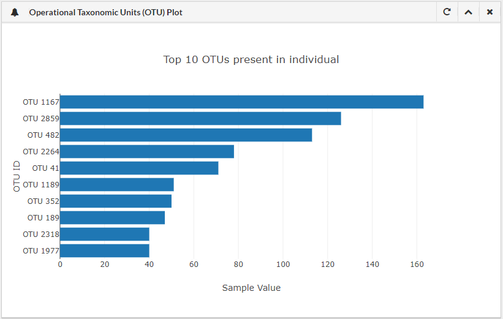
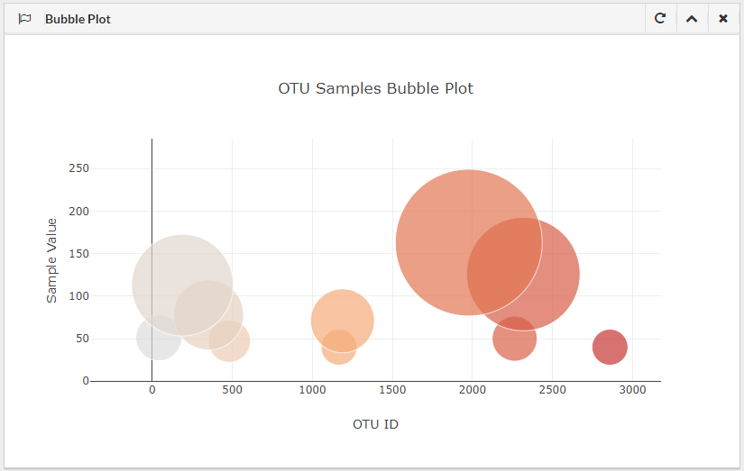
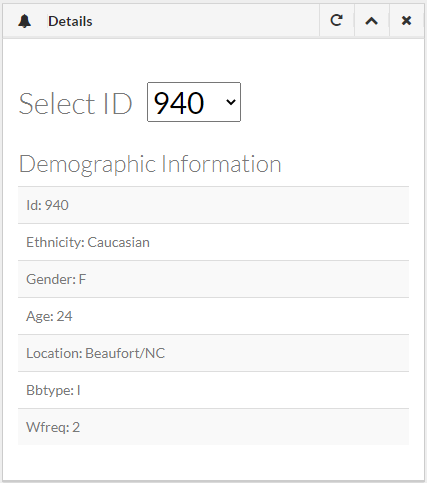
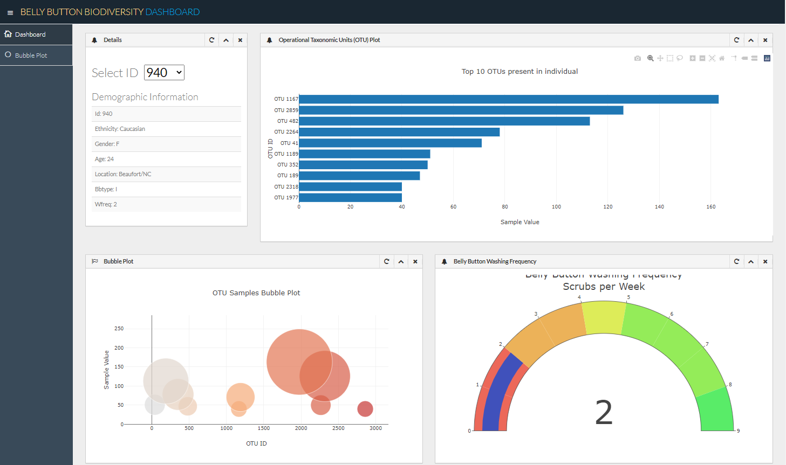
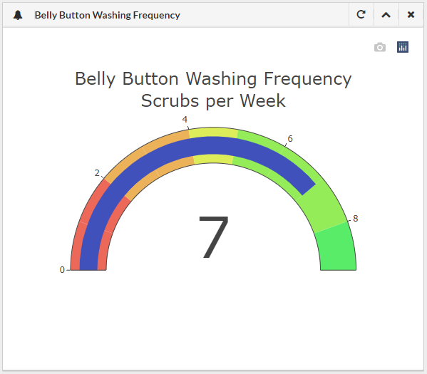

# Plot.ly Challenge - Belly Button Biodiversity

In this challenge, an interactive dashboard was built to explore the [Belly Button Biodiversity dataset](http://robdunnlab.com/projects/belly-button-biodiversity/), which catalogs the microbes that colonize human navels.

The dataset reveals that a small handful of microbial species (also called operational taxonomic units, or OTUs, in the study) were present in more than 70% of people, while the rest were relatively rare.

[Link to Belly Button Biodiversity Dashboard](https://melissamonroe.github.io/plotly-challenge/)

## Step 1: Plotly

1. Used the D3 library to read in `samples.json`.

2. Created a horizontal bar chart with a dropdown menu to display the top 10 OTUs found in that individual.

* Used `sample_values` as the values for the bar chart.

* Used `otu_ids` as the labels for the bar chart.

* Used `otu_labels` as the hovertext for the chart.

  

3. Create a bubble chart that displays each sample.

* Used `otu_ids` for the x values.

* Used `sample_values` for the y values.

* Used `sample_values` for the marker size.

* Used `otu_ids` for the marker colors.

* Used `otu_labels` for the text values.

4. Display the sample metadata, i.e., an individual's demographic information.

5. Display each key-value pair from the metadata JSON object somewhere on the page.

6. All plots are updated any time that a new sample is selected.

## Advanced Challenge Assignment (Optional)

* Adapted the Gauge Chart from <https://plot.ly/javascript/gauge-charts/> to plot the weekly washing frequency of the individual.

* Example gauge chart modified to account for values ranging from 0 through 9.

* Chart is updated whenever a new sample is selected.

## Notes

* `console.log` was used inside js code to preview data

* Reference to plotly documentation: [Plotly.js documentation](https://plot.ly/javascript/)

### About the Data

Hulcr, J. et al.(2012) _A Jungle in There: Bacteria in Belly Buttons are Highly Diverse, but Predictable_. Retrieved from: [http://robdunnlab.com/projects/belly-button-biodiversity/results-and-data/](http://robdunnlab.com/projects/belly-button-biodiversity/results-and-data/)

